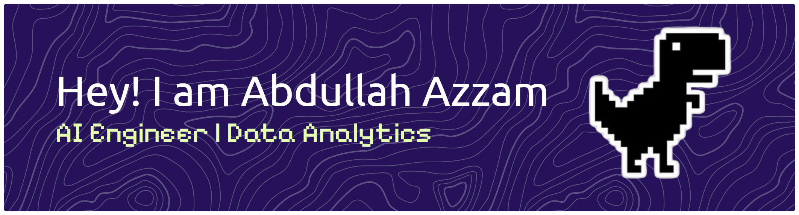

  

###

  
  
  
  

###

###

<h1 align="center">hey there 👋</h1>

###

<h3 align="left">👩‍💻  About Me</h3>

###

I'm Abdullah Azzam from Majene, West Sulawesi, Indonesia.  - 📚 I'm currently learning AIGen & Data Analytics

###

<h3 align="left">🛠 Language and tools</h3>

###

  
  
  
  
  
  
  
  
  
  
  
  
  
  
  
  
  
  
  
  
  
  
  
  
  
  
  

###
## 🏆 GitHub Trophies

###

<h3 align="left">🔥   My Stats :</h3>

###

 
 

###

## 🧩 Lets Play! 

###

<picture>
  <source media="(prefers-color-scheme: dark)" srcset="https://raw.githubusercontent.com/zaammm16/zaammm16/output/pacman-contribution-graph-dark.svg">
  <source media="(prefers-color-scheme: light)" srcset="https://raw.githubusercontent.com/zaammm16/zaammm16/output/pacman-contribution-graph.svg">
  
</picture>

###

### 🔝 Top Contributed Repo

